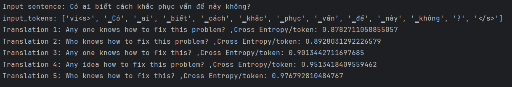
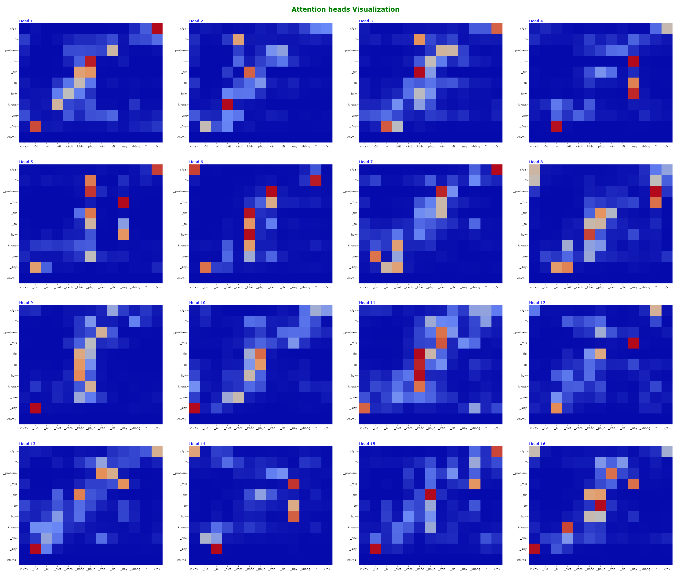
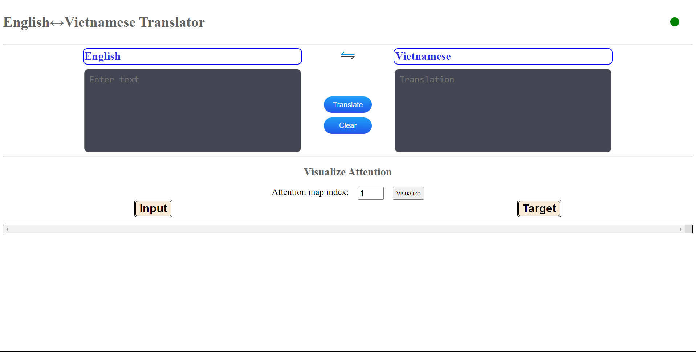

# English-Vietnamese Bilingual Translation with Positional Separated Attention Transformer 
- Continued development from the repo [NeuralMachineTranslation](https://github.com/hsthe29/NeuralMachineTranslation)

```
@github{Translation,
  author    = {The Ho Sy},
  title     = {English-Vietnamese Bilingual Translation with Transformer},
  year      = {2023},
  url       = {https://github.com/hsthe29/Translation},
}
```

# Model Architecture
- Modified from Vanilla Transformer's Architecture

# Data
- See [PhoMT](https://github.com/VinAIResearch/PhoMT).

# Training Task:
- Target Masked Translation Modeling (Target MTM)
  - Target MTM:
    ```
    Training: 
      input: ["en<s>", "How", "are", "you?", "</s>"]
      target in: ["vi<s>", "Bạn", "có", "<mask>", "không?", "</s>"]
      target out: ["Bạn", "có", "khỏe", "không?", "</s>", "<pad>"]
    Inference:
      input: ["en<s>", "How", "are", "you?", "</s>"]
      target in: ["vi<s>"]
      Autoregressive -> full target out: ["vi<s>", Bạn", "có", "khỏe", "không?", "</s>"]
    ```

# Bilingual Vocabulary:
- English sentence start token: `en<s>`
- Vietnamese sentence start token: `vi<s>`
- End sentence token: `</s>`
- Mask token: `<mask>` for task MLM (training only)

# Example:
- Natural english `"Hello, how are you?"`, target start token `"vi<s>"`: 
  - Transform to `"en<s> Hello, how are you? </s>"`
  - Target: `"vi<s> Xin chào, bạn có khỏe không? </s>""`
- Natural vietnamese `"Xin chào, bạn có khỏe không?"`, target start token `"en<s>"`: 
  - Transform to `"vi<s> Xin chào, bạn có khỏe không? </s>"`
  - Target: `"en<s> Hello, how are you? </s>""`

# Model configuration
- See file [config.py](transformer/model/config.py) and [configV1.json](assets/config/configV1.json)

# Preload dataset
- Because of the large amount of data, my resources are limited, so I have to process and segment the data to be able to train the model.
- Preload parameter:
  - seed: a seed to create randoms from random generator 
  - shuffle: if True, the dataset will be shuffled before chunked
  - chunk_size: size of each chunk

# Training parameters
- Optimizer: AdamW
- Learning rate scheduler: WarmupLinearLR
```
Training arguments:
  - config: "assets/config/configV1.json"
  - load_prestates: True
  - epochs: 20
  - init_lr: 1e-4
  - train_data_dir: /path_to_train_data_dir/
  - val_data_dir: /path_to_val_data_dir/
  - train_batch_size: 16
  - val_batch_size: 32
  - print_steps: 500
  - validation_steps: 1000
  - max_warmup_steps: 10000
  - gradient_accumulation_steps: 4
  - save_state_steps: 1000
  - weight_decay: 0.001
  - warmup_proportion: 0.1
  - use_gpu: True
  - max_grad_norm: 1.0
  - save_ckpt: True
  - ckpt_loss_path: /path_to_loss_ckpt/
  - ckpt_bleu_path: /path_to_bleu_ckpt/
  - state_path: /path_to_state/
```

# Training
```
$ pip install -r requirements.txt
$ python preload_data.py --config=... --data_dir=... --save_dir=... --chunk_size=... --shuffle=...
$ python train.py [training arguments]
```

# Inference

<p align="center" width="100%">
     
</p>

<p align="center" width="100%">
     
</p>

# Web server
- Use [Flask](https://github.com/pallets/flask) to deploy a simple web server run on `localhost` that provides bilingual translation and visualizes attention weights between pairs of sentences
- Use [Plotly.js](https://plotly.com/javascript/) to visualize attention maps.
- Use [checkpoint]() at step 12000, Cross Entropy per tokens(updating)
- Run: `$ python run_app.py` or `$ python3 run_app.py`

## Simple UI

<p align="center" width="100%">
     
</p>

## Attention maps
...

# Please give me a star if you find this project interesting 
